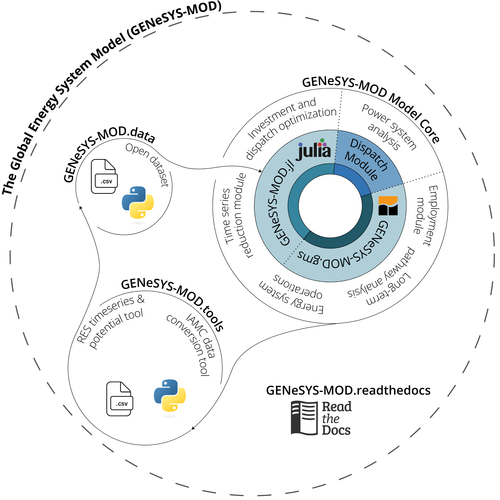

# Summary

GENeSYS-MOD is a flexible framework that allows the modelling of energy systems at various degrees of detail, with a focus on sector coupling and the computation of long-term pathways for the energy system. The generic formulation makes the framework able to be implemented for a wide range of use cases, allowing for a widely user-defined resolution in terms of temporal, spatial, and technological detail. GENeSYS-MOD performs a cost-optimizing investment and dispatch calculation across all modeled subsectors of the energy system (usually covering at least electricity, buildings, industry, and transport). The newest, fourth version of the framework is now available in both GAMS and Julia for the core model, with optional data management tools written in Python. 

# Statement of need

Energy system models are powerful tools commonly used to create detailed insights into possibly future developments of the energy system, providing valuable information to decision makers. This includes a variety of model outputs such as cost-efficient capacity planning for both generation and flexibility options, as well as information on the resulting costs, supply mixes, and emission trajectories. Noteworthy examples of other established open energy system modelling frameworks include PyPSA [@brown_pypsa_2018], OSeMOSYS [@howells_osemosys_2011], oemof [@hilpert_open_2018], Balmorel [@wiese_balmorel_2018], TIMES [@loulou_documentation_2005], or EMPIRE [@backe_empire_2022]. A comparison of several open source energy system modelling frameworks, including GENeSYS-MOD can be found at @candas_code_2022 . 

GENeSYS-MOD, which stands for "The Global Energy System Model", was originally released in 2017 [@loffler_designing_2017] and has since then been updated and expanded several times. However, one major shortcoming of older GENeSYS-MOD versions was that it was only available for the General Algebraic Modeling Language (GAMS), a commercial software for model building, which restricted the openness of the framework. Therefore, with version 4.0, we now introduce a new Julia version of GENeSYS-MOD that offers the exact same functionality as the GAMS-based version, but removes all commercial license requirements, especially when also using an open solver such as HiGHS. 

# Overview over the functionality and capabilities of GENeSYS-MOD

GENeSYS-MOD is a cost-optimizing linear program that computes cost-optimal pathways for the energy system across multiple sectors, usually focusing on long-term pathways for the energy system. \autoref{fig:inputs_outputs} shows some of the core inputs and outputs of the model.
Contrary to what the name suggests, GENeSYS-MOD can not only be applied at the global level (even though that was the initial application [@loffler_designing_2017]), but instead is purely data-driven and has been successfully used in both macro-regional (e.g. Europe) [@moskalenko_europes_2024], country-level [@hanto_effects_2021], and even regional levels [@herpich_100_2024]. 

{width="90%"}

## Methodological background

In its origin, GENeSYS-MOD is based on the Open Source Enenergy Modelling System (OSeMOSYS), but has been altered and expanded in functionality over time. Nevertheless, the overall structure and nomenclature have been kept as measures to make the model easy to learn and use.
GENeSYS-MOD optimizes the investment decisions on an annual level for a defined model period, usually given in five-year steps towards 2050 or 2060. It then assumes a planner's perspective with perfect foresight as the default option, however, a myopic approach can also be chosen. The time resolution within a year can be flexibly defined via a timeseries reduction algorithm following @gerbaulet_dynelmod:_2017 . This means that depending on the user's computational resources and model setup, almost any time resolution, up to full hourly operation, can be chosen.

# General framework structure of GENeSYS-MOD version 4

The overall ecosystem of GENeSYS-MOD has been growing over time and now includes a multitude of features not only within, but also in conjunction with the core modelling framework. \autoref{fig:ecosystem} displays a graphic representation of the different repositories and features.

{width="95%"}

## GENeSYS-MOD.data

The GENeSYS-MOD.data repository contains all the individual input parameters for building models, stored in csv files. Python-based scripts enable a filtering, aggregation, and disaggregation of data. The scripts then return standardized input files for the core model. Users can also directly download finished input data files, thus use of these features is optional.

## GENeSYS-MOD core model

The core model source code of GENeSYS-MOD is available in both GAMS and Julia, with both versions being maintained side by side. The model also features a dispatch module, aimed at evaluating the electricity supply configuration that GENeSYS-MOD has provided.

## GENeSYS-MOD.tools

At this current time, two tools are provided: one focused on generating renewable timeseries and capacity potentials, making use of the open source Atlite package [@hofmann_atlite_2021], as well as one conversion script, allowing GENeSYS-MOD datasets to be converted into the IAMC nomenclature (see [here](https://nomenclature-iamc.readthedocs.io/en/stable/)).

## Documentation

Encompassing all the other tools and the core model, the documentation is now provided via a readthedocs page that is continuously expanded. Also, there are additional resources in the form of video tutorials uploaded to a [YouTube channel](https://www.youtube.com/@genesys-mod).

# New features of GENeSYS-MOD version 4

\autoref{fig:version_blocks} displays the additions across multiple major versions of GENeSYS-MOD.

## 

## 

## 

# Past and ongoing research applications

GENeSYS-MOD has been used in a wide range of academic publications and research projects with several different regional focus points and research questions. 

# Perspective

The software and its ecosystem are under constant development and always looking to improve, be it in terms of functionalities, accessibility, or new exciting research opportunities. Therefore, a small community has established itself, with regular online meetings and an annual development workshop. The goal would be to follow great pioneers like the OSeMOSYS community in that regard, like described in @gardumi_development_2018 .

# Acknowledgements

We would like to thank everyone that has been involved in this project over the years, especially Thorsten Burandt, who has been one of the original co-creators of the framework, as well as Pao-Yu Oei and Christian von Hirschhausen who have guided us over the years. A special thanks also goes out to everyone that keeps contributing and using our tool, and provides valuable feedback for us. We also acknowledge funding from TU Berlin and SINTEF Energy Research, which has enabled us to work on the topic, as well as several research projects that have made contributions to the further development of the framework and surrounding tools. Most recently, this work was supported by the CETPartnership project Man0EUvRE under Grant Agreement number 101069750 as well as the Horizon Europe projects iDesignRES (GA number 101095849) and OpenMod4Africa (GA number 101118123).

# References