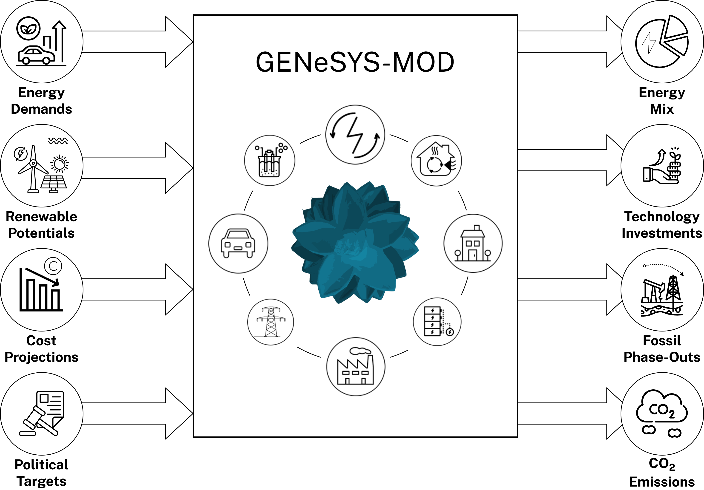

# Summary

GENeSYS-MOD is a flexible framework that allows the modelling of energy systems at various degrees of detail, with a focus on sector coupling and the computation of long-term pathways for the energy system. The generic formulation makes the framework able to be implemented for a wide range of use cases, allowing for a widely user-defined resolution in terms of temporal, spatial, and technological detail. GENeSYS-MOD performs a cost-optimizing investment and dispatch calculation across all modeled subsectors of the energy system (usually covering at least electricity, buildings, industry, and transport). The newest, fourth version of the framework is now available in both GAMS and Julia for the core model, with optional data management tools written in Python. 

# Statement of need

Energy system models are powerful tools commonly used to create detailed insights into possibly future developments of the energy system, providing valuable information to decision makers. 

The Global Energy System Model (GENeSYS-MOD) was originally released in 2017 [@loffler_designing_2017] and has since then been updated and expanded several times. However, one major shortcoming of older GENeSYS-MOD versions was that it was only available for the General Algebraic Modeling Language (GAMS), a commercial software for model building, which restricted the openness of the framework. Therefore, with version 4.0, we now introduce a new Julia version of GENeSYS-MOD that offers the exact same functionality as the GAMS-based version, but removes all commercial license requirements, especially when also using an open solver such as HiGHS. 

# General framework structure

Single dollars ($) are required for inline mathematics e.g. $f(x) = e^{\pi/x}$

Double dollars make self-standing equations:

$$\Theta(x) = \left\{\begin{array}{l}
0\textrm{ if } x < 0\cr
1\textrm{ else}
\end{array}\right.$$

You can also use plain \LaTeX for equations
\begin{equation}\label{eq:fourier}
\hat f(\omega) = \int_{-\infty}^{\infty} f(x) e^{i\omega x} dx
\end{equation}
and refer to \autoref{eq:fourier} from text.

## Overview over the functionality and capabilities of GENeSYS-MOD

\autoref{fig:inputs_outputs} shows some of the core inputs and outputs of the model.

{width="90%"}

## Methodology background

# New features of GENeSYS-MOD version 4

\autoref{fig:version_blocks} displays the additions across multiple major versions of GENeSYS-MOD.

## 

## 

## 

# Past and ongoing research applications

Citations to entries in paper.bib should be in
[rMarkdown](http://rmarkdown.rstudio.com/authoring_bibliographies_and_citations.html)
format.

If you want to cite a software repository URL (e.g. something on GitHub without a preferred
citation) then you can do it with the example BibTeX entry below for.

For a quick reference, the following citation commands can be used:
- `@author:2001`  ->  "Author et al. (2001)"
- `[@author:2001]` -> "(Author et al., 2001)"
- `[@author1:2001; @author2:2001]` -> "(Author1 et al., 2001; Author2 et al., 2002)"

# Perspective

# Acknowledgements

We would like to thank everyone that has been involved in this project over the years, especially Thorsten Burandt, who has been one of the original co-creators of the framework, as well as Pao-Yu Oei and Christian von Hirschhausen who have guided us over the years. A special thanks also goes out to everyone that keeps contributing and using our tool, and provides valuable feedback for us. We also acknowledge funding from TU Berlin and SINTEF Energy Research, which has enabled us to work on the topic, as well as several research projects that have made contributions to the further development of the framework and surrounding tools. This work was supported by the CETPartnership project Man0EUvRE under Grant Agreement number 101069750 as well as the Horizon Europe project iDesignRES (GA number 101095849).

# References